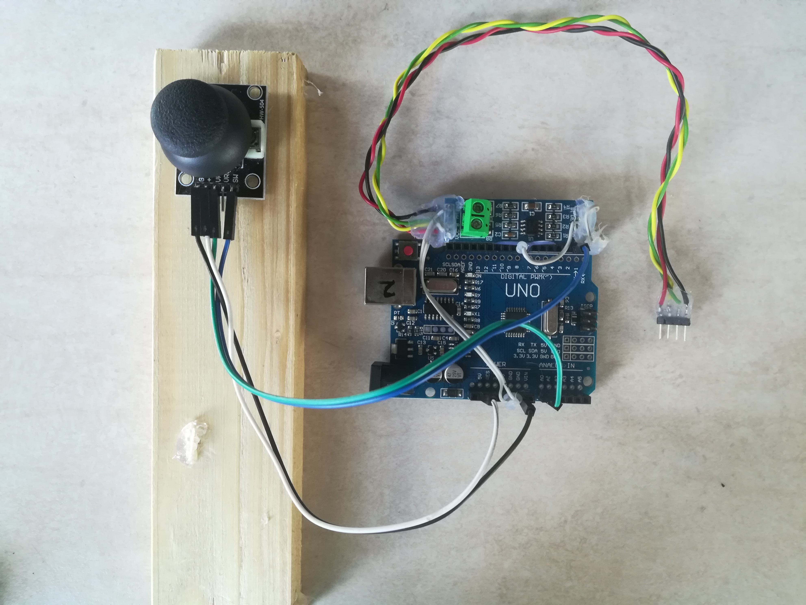
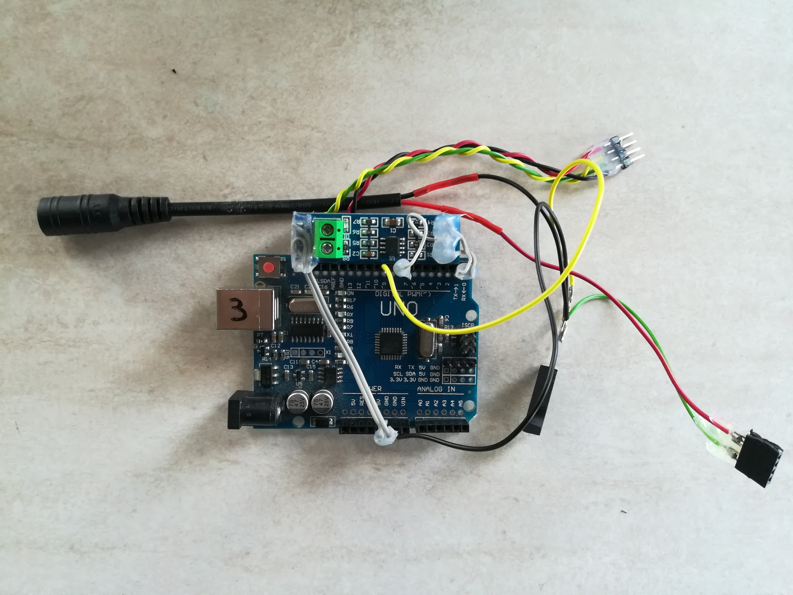

# smartHouse (Multi Device)

Project is divided in two parts:

- dudeNet (physical layer protocol)

- smartHouse (simple use of dudeNet)

## dudeNet

DudeNet is a simple protocol designed for Master-multiSlave **RS485** network. It supports **Atmega328P** and **Linux platform**.

Linux PC is MASTER, and Atmega328P devices are SLAVE. Master **query periodically**slaves to get information.

### dudeNet packet

    START - DESTINATION - SOURCE - PAYLOAD__SIZE - PAYLOAD - CRC_16bit

```c
typedef struct packet_t{
    uint8_t start_0;
    uint8_t start_1;

    address_t dst;
    address_t src;

    uint8_t size;
    
    uint8_t payload[MAX_PAYLOAD_SIZE];

    uint8_t crc_1;
    uint8_t crc_0;
}packet_t;
```

> **Source**: dudeNet/DNRouting.h

### Packet Handler

#### Linux

Since Linux PC is Master, packet handler is not events based, so it uses simple read write function:

```c
// read packet, if there isn't ready packet wait TIMEOUT_ms
res_t DNRouting_read(volatile packet_t* packet){
    double timeout =  TIMEOUT_ms * 1E03;
    uint16_t data = getChar(&timeout); //getChar is a custom function
    if(data==NO_DATA_TO_READ || timeout <= 0.0){
        DNError = ERR_TIMEOUT; 
        DNError_func = __func__;
        return -1;
    }

    while(!buildPacket((uint8_t)data, packet)){
        data = getChar(&timeout);
        if(data==NO_DATA_TO_READ || timeout <= 0.0){
            DNError = ERR_TIMEOUT;
            DNError_func = __func__; 
            return -1;
        }
    }
    
    if(RX_info.packet_is_addressed_to_me)   {
        return packet->size;
    }
    else{
        DNError=ERR_DST;
        DNError_func = __func__;
        return -1;
    }
}
```

```c
// write packet
// NOTE: this function add only start bytes, src (myAddress) and crc
// NOTE: this function add crc after payload to obtain contiguous array
res_t DNRouting_write(volatile packet_t* packet){

    packet->src=myAddress;
    
    crc_t crc = crcFast((unsigned char*) packet, 
                            PRE_PAYLOAD_LENGTH + packet->size);
    packet->crc_1 = (uint8_t) (crc>>8);
    packet->crc_0 = (uint8_t) crc;

    packet->payload[packet->size] = packet->crc_1;
    packet->payload[packet->size+1] = packet->crc_0;
        
    TXBuffer.buffer=(uint8_t*)packet;
    TXBuffer.size = PRE_PAYLOAD_LENGTH + packet->size + 2; 
    UART_write(&TXBuffer);
}
```

**Source**: dudeNet/DNRouting_LinuxMaster.c


#### Atmega328P

Atmega328P code instead uses interrupts to read, write and handler a packet.

##### Read Packet

Atmega328P builds packet in **USART_RX_vect ISR** using a state machine indicated by RX_status() function.

```c
ISR(USART_RX_vect){
    RX_status(UDR0);
}
```

> **Source**: dudeNet/DNRouting_AtmegaSlave.c

##### Write Packet

```c
// write packet
// NOTE: this function add only start bytes, src (myAddress) and crc
// NOTE: this function add crc after payload to obtain contiguous array
res_t DNRouting_write(volatile packet_t* packet){

    packet->src=myAddress;
    
    crc_t crc = crcFast((unsigned char*) packet, 
                PRE_PAYLOAD_LENGTH + packet->size);
    packet->crc_1 = (uint8_t) (crc>>8);
    packet->crc_0 = (uint8_t) crc;

    packet->payload[packet->size] = packet->crc_1;
    packet->payload[packet->size+1] = packet->crc_0;
    
    while(!UART_write_completed); // wait previous write end
    
    UART_write((uint8_t*)packet, PRE_PAYLOAD_LENGTH + packet->size + 2);
}
```


UART_write() uses USART_TX_vect interrupt

```c
ISR(USART_TX_vect){
    if(TXBuffer_index == TXBuffer_size){ //TXComplete
        #ifdef RS485
            MAX485_enableRX();
        #endif
        UART_write_completed = true;
    }
    else{
        UDR0 = TXBuffer[TXBuffer_index++];
    }
}
```

> **Source**:      dudeNet/DNRouting_AtmegaSlave.c
> 
>                     dudeNet/lib/Atmega328P/UART/UART.c

##### Packet Handler

In last state of RX_status() (i.e. get_CRC()), when packet is ready, it throws a software interrupt through readyPacketInterrupt_throwINT() macro.

```c
void get_CRC(uint8_t data){
    if(crc_n) {
        packetRX.crc_1=data;
        packetRX.payload[RX_index++] = data;
        crc_n = 0;
        return;
    }
    //end packet
    packetRX.crc_0=data;
    packetRX.payload[RX_index++] = data;
    crc_n = 1;
    
    crc_t crc = crcFast((unsigned char*) &packetRX, 
                            PRE_PAYLOAD_LENGTH + packetRX.size + 2);
    if(crc){
        //wrong CRC
        RX_info.reading_packet=false;
        RX_info.packet_ready=false;
    }
    else{
        RX_info.reading_packet=false;
        RX_info.packet_ready=true;
    }
    RX_status=get_start_0;
    RX_info.reading_packet=false;
    
    if(RX_info.packet_ready) readyPacketInterrupt_throwINT();
    RX_info.packet_ready = false;

}
```

**readyPacketInterrupt** is a simple pin change interrupt. packetHandler() is a user function pointer

```c
ISR(PCINT2_vect){

  unsigned char pins_changed = oldPORTD ^ PORTD;
  oldPORTD = PORTD;

  /*
  * HANDLER PACKET READY INTERRUPT
  */
  if(rbi(pins_changed, PD4)){  //execute if only pin 4 changed state
    readyPacketInterrupt_disable(); //avoid nested same interrupt

    //SREG will restored after ISR with reti istruction
    sei();  //enable nested interrupt
    packetHandler(&packetRX);//  netHandler();

    readyPacketInterrupt_enable();
  }
}
```

> **Source**: dudeNet/DNRouting_AtmegaSlave.c
> 
>                dudeNet/lib/Atmega328P/readyPacketInterrupt.c

## SmartHome

### Atmega328P Peripherals used:

- [x] ADC (read Joystick position)

- [x] TIMER0 (millis() function)

- [x] TIMER2 (PWM)

- [x] EEPROM (used to store led brightness and led status)

Example of dudeNet is based on a Master and two Slaves. 

Slaves are two Arduino UNO,  with different tasks:

- **dimmerable LED** (uses PWM)

- **LED brightness controller** (uses analog Joystick)

Master query slaves periocally so that commands from **LED controller** are forwarded to  **LED**

```c
    while(1){
        int16_t res;
        res = read_contrller();
        if(res==-1){
            printf("Error read controller\n");
            continue;
        }
        if(res == NONE) continue;
        res = send_command_to_led(res);
        if(res==-1){
            printf("Error send command to led\n");
            continue;
        }
    }
```

> **Source**: smartHouse/Linux/main.c

### Application protocol

#### Packet

```c
typedef struct application_packet_t{
    uint8_t dst;
    uint8_t src;
    uint8_t size;
    
    uint8_t command; 
}application_packet_t;
```

```c
////////////// COMMAND ///////////////////
    #define INCREMENT       127
    #define DECREMENT       126

    #define NONE            123 
    #define TOGGLE_STATUS   122     

    #define ACK             121
    #define READ            64
```

> **Source**: /smartHouse/packet.h

### Hardware

#### Led Controller



#### Led Device


